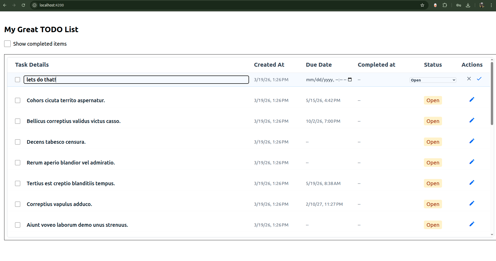

# Engager Todo App

Full-stack todo application demonstrating modern frontend and backend patterns.

## Tech Stack

**Backend**
- NestJS + TypeORM + PostgreSQL
- Cursor-based pagination for infinite scroll
- OpenAPI/Swagger auto-generated docs (`/docs`)

**Frontend**
- Angular 21
- TanStack Query (data fetching, caching, optimistic UI)
- TanStack Virtual (windowing for large lists)
- Auto-generated API client from backend Swagger
- TailwindCSS

## Quick Start

```bash
# Backend
cd backend 
docker compose up -d  # Start PostgreSQL
npm install && npm run seed:tasks   # Install & seed data
npm run start:dev                    # Run dev server (http://localhost:3000)

# Frontend
cd frontend && npm install
npm run start                        # Run dev server (http://localhost:4200)
npm run generate-api                 # Regenerate API client from backend
```

## Key Features

- **Cursor Pagination** – Efficient infinite scroll with no offset performance issues
- **Virtual Scrolling** – Renders only visible items
- **Optimistic UI** – Instant feedback with background sync


